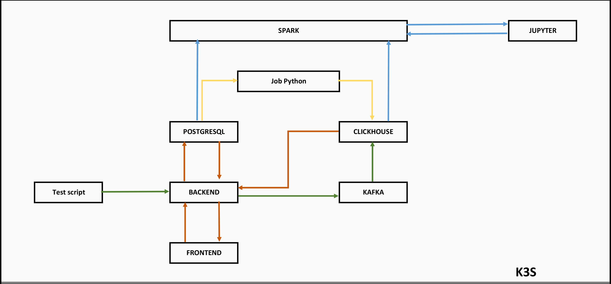

# MyFitnessAppDemo

This is a project for the "Big Intensive Application and Big Data" exam of the Perugia's University of Studies.

This project gives:

- Kubernetes deployment [k3s/README.md](k3s/README.md).

## What is MyFitnessAppDemo

This project aims to simulate a fitness application that permits storing workout sessions and running sessions. Every choice has been made considering an application with 500'000+ users.
This project is composed by the following components:

- k3s cluster as orchestrator
- React frontend (port 5173)
- Express backend (port 3001)
- Postgresql database (port 5432)
- Clickhouse database (port 8123)
- Kafka message broker (port 9092)
- Spark streaming jobs (port 7077)
- Jupyter notebook for data analysis (port 8888)
- Other scripts for testing and data generation

# Architecture and functionality

### Frontend

The frontend is necessary to show the database sinergy both with Clickhouse and Postgresql.
It allow to:

- Display user information from Postgresql
- Display workout sessions from Clickhouse
- Push updates to the backend for Postgresql
- Start/Stop smartwatch simulator
- Start/Stop Spark jobs
- Start/Stop ELT process script

It runs as Kubernetes Deployment with 2 replicas.
This ensures high availability and load balancing for the frontend component.

### Backend

The backend do the following operations:

- Read/Write operation on Postgresql
- Read operation on Clickhouse
- Push events from the smartwatch simulator to Kafka
- Simulate Spark jobs activation
- Activate/Deactivate the ELT process script

It runs as a Kubernetes Deployment with 2 replicas.
This provides high availability and load balancing for the backend component.

### Smartwatch simulator script

Is necessary to simulate user activities and to push them to the backend.
A parallel python script is the best choice but to not overcomplicate the project and put too much stress on the system, a simple script is used.

### ELT process script

It's function is to read events from Postgresql and copy them to Clickhouse.
It works periodically to synchronize the data between the two databases: it reads the last id of the events already copied and then copies only the new events.
It runs periodically through a Kubernetes CronJob and can also be triggered manually from the frontend. Each execution reads only the new events that have not already been copied.
As with the smartwatch simulator, it is implemented as a simple script even though in a real-world scenario it could be a more complex parallel Python process.

### Postgresql

It store all the data about user information and gym workouts. Citus extension is not the best choice for this project because the volumes of data is not so high (500'000 users). But a future increase in data volume could justify its use.

It runs as a Kubernetes StatefulSet with 1 replica.
This ensures that the Postgresql component is available, but with only 1 replica, it does not provide high availability.

### Clickhouse

It stores all the data about gym workouts and running sessions. It is used for analytics and data analysis through its efficient read and query capabilities.

It runs as two Kubernetes StatefulSets, one for each shard, with 2 replicas per shard.
This configuration improves availability and allows ClickHouse to tolerate the failure of one replica per shard.
The sharding strategy uses a hash of `athlete_id` to distribute data across the two shards. Therefore, data for the same athlete is normally stored on the same shard. This is suitable for the application because its main access pattern is athlete-oriented and relationships between different athletes are not central to the queries.

Each `_local` table is a physical `ReplicatedMergeTree` table present on every ClickHouse server. It stores the data belonging to that server's shard and replicates it to the other replica of the same shard. The table without the `_local` suffix is a logical `Distributed` table: it provides a single cluster-wide view, routes inserts using `cityHash64(athlete_id)`, and sends queries to the relevant shards before combining their results.

It needs a coordinator to manage replicated tables and coordinate the ClickHouse servers. In this project, ClickHouse Keeper is used as the coordinator. It runs as a Kubernetes StatefulSet with 3 replicas, allowing the Keeper quorum to survive the failure of one replica.

With 4 ClickHouse pods and 3 Kubernetes nodes, at least one node must host more than one pod. This is acceptable when the two pods on that node belong to different shards: losing the node then removes one replica from each shard, while the other replicas remain available. To enforce that the two replicas of the same shard are scheduled on different nodes, the deployment uses two separate StatefulSets with mandatory pod anti-affinity for each shard. The application still connects through the shared `clickhouse` Service, while ClickHouse uses the shard-specific DNS names for internal communication.

### Kafka

It is used as message broker to store safely all the events generated by the smartwatch simulator script.
It runs as a Kubernetes StatefulSet with 3 replicas to ensure high availability and quorums even in case of failures of one replica. It uses Kafka Raft (KRaft) mode for metadata management instead of relying on ZooKeeper (deprecated).

It is used with the Kafka UIs for monitoring and managing the Kafka cluster easily.
It runs as a Kubernetes Deployment with only one replica because it is mainly used for monitoring and management purposes, and high availability is not critical for this component.

Kafka stream is used to read events and to push them to Clickhouse. Kafka stream is a good choice because it is fast and distributed.
Spark would be overkill for this project due to the relatively small volume of data and the simplicity of the analysis tasks.
It is important to note that Kafka streams operate in real-time, providing low-latency data processing, which complements the batch-oriented nature of Spark for more complex analytics tasks.
It runs as a Kubernetes StatefulSet with 2 minimum replicas and can scale up to 6 replicas through KEDA, based on the Kafka consumer lag. Six replicas is the maximum useful value for `heart-rate-events`, which has six partitions.

### Spark

It is used to make data analysis reading data from Clickhouse and Postgresql databases.
It runs on Kubernetes in client mode to perform data analysis tasks as needed.
When launched from the Jupyter notebook, the Jupyter pod acts as the Spark driver. The current notebook configuration disables dynamic allocation and requests 4 executor pods; this number can be changed in the notebook configuration.
When launched from the backend, the backend creates a Kubernetes Job whose pod runs the Spark driver. Dynamic allocation is enabled for this job, so Spark starts with 1 executor pod and can dynamically scale up to 4 executor pods according to the workload and available cluster resources.

At this moment Spark is used to compute the correlation matrix of the main features that act for the heart derived metrics.

### Jupyter notebook

It allow to show the Spark reports.
It runs as a Kubernetes Deployment with only one replica because it is mainly used for displaying reports and high availability is not critical for this component.

### k3s

It is used as orchestrator to manage all the components of the project and scale them if necessary.

# Recommended Startup

To start the cluster, follow the guide in [k3s/README.md](k3s/README.md).
